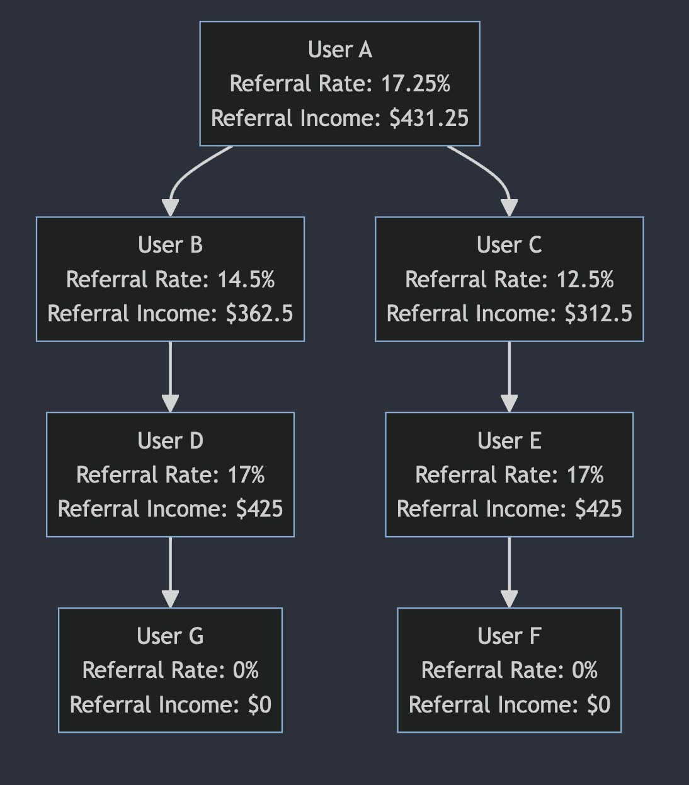

<h1>BTC Goldstandard Referral System</h1>

Invite friends to join the Goldstandard community and experience a new way to earn BTC. Invite more friends and earn more BTC. During this 6 month limited time event, the referral rate for the first 6 months is 100%, with the platform taking no cut.
 

<h2>BTC Goldstandard Platform 100% Referral Rules</h2>

<h3>Spot Trading and Gamefi Trading (more blockchain consumption scenarios are under construction):</h3>

Once a new user successfully registers on the Goldstandard platform through the referral mode, the referrer can earn commissions (BTC) from the transaction fees generated by the referred user through any spot or Gamefi trading on Goldstandard.

<h3>Referral Code Rules</h3> 

For example, user A refers user B through a referral code and binds the relationship on the BTC chain. If user C then uses B's referral code, the relationship is:

As long as user B generates any BTC transaction fees through activities on the Goldstandard platform, user A can earn the referral commissions (BTC) from those fees. <b>All platform revenue belongs to the referrers.</b>

<h3>Referral Rate Rules</h3>

<aside>
<b>Initial Referral Rate: 100%</b> 
The referrer can earn commissions from all transaction fees generated by their referrals down the line. The referral rate decreases with each level, so commissions from the lowest levels will gradually decrease.
</aside> 

<h2>The Platform Takes No Cut - All Profits Go to Referrers</h2>

<h3>Dynamic Referral Rate Adjustment Formula:</h3> 

For a level n referrer, their referral rate is equal to the initial referral rate multiplied by g to the power of n-1, where g represents the decay factor.

<b><big>

Referral Rate = Initial Referral Rate * g^{(n-1)} 

</big></b>

<h3>Example 1:</h3>

Assuming 4 users: A, B, C, D, with the following data:

<ul>
  <li>Total platform revenue of $1800</li> 
  <li>User A refers B, B refers C, C refers D. B contributes $1000 in fees, C contributes $500, D contributes $300.</li>
  <li>Initial 1st level referral rate of 100%, decay factor g of 0.5</li>
</ul>

Total platform revenue is $1800.

<h3>Example 2:</h3> 

Assuming 6 users: A, B, C, D, E, F, G with the following relationships and data:

<h2>Referral Relationship Graph</h2>

When a user logs in, the system dynamically generates a personalized referral graph showing their direct and indirect referrals.
 

<h2>Season Settlement</h2> 

Each season is 3 months. Settlement occurs 5-10 days after each season. Extra platform fees generated during settlement are not included. Settlement distributes actual BTC commissions to each referrer's account.

</body>
</html>
