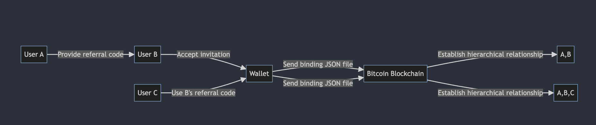
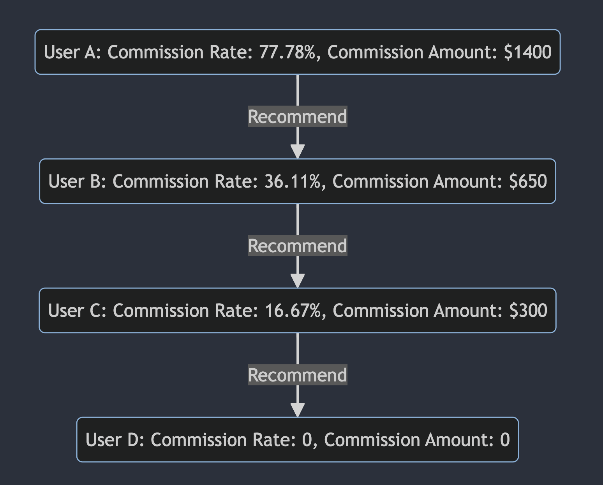

<h1>BTC Goldstandard Referral System</h1>

Invite friends to join the Goldstandard community and experience a new way to earn BTC. Invite more friends and earn more BTC. During this 6 month limited time event, the referral rate is at 100%, with the platform taking no cut.
 

<h2>BTC Goldstandard Platform 100% Referral Rules</h2>

<h3>Spot Trading and Gamefi Trading (more blockchain consumption scenarios are under construction):</h3>

Once a new user successfully registers on the Goldstandard platform through the referral mode, the referrer can earn commissions (BTC) from the transaction fees generated by the referred user through any spot or Gamefi trading on Goldstandard.

<h3>Referral Code Rules</h3> 

For example, user A refers user B through a referral code and binds the relationship on the BTC chain. If user C then uses B's referral code, the relationship is:

As long as user B generates any BTC transaction fees through activities on the Goldstandard platform, user A can earn the referral commissions (BTC) from those fees. <b>All platform revenue belongs to the referrers.</b>

<h3>Referral Rate Rules</h3>

<aside>
<b>Initial Referral Rate: 100%</b> 
The referrer can earn commissions from all transaction fees generated by their referrals down the line. The referral rate decreases with each level, so commissions from the lowest levels will gradually decrease.
</aside> 

<h2>The Platform Takes No Cut - All Profits Go to Referrers</h2>

<h3>Dynamic Referral Rate Adjustment Formula:</h3> 

For a level n referrer, their referral rate is equal to the initial referral rate multiplied by g to the power of n-1, where g represents the decay factor.

<b><big>

Referral Rate = Initial Referral Rate * g^{(n-1)} 

</big></b>

<h3>Example 1</h3> 
Assumptions: 4 users - A, B, C, D
 <ul> <li>Total platform revenue: $1800</li> <li>User A referred User B</li> <li>User B referred User C</li> <li>User C referred User D</li> <li>User B contribution: $1000 fees</li> <li>User C contribution: $500 fees</li> <li>User D contribution: $300 fees</li> <li>Initial referral rate: 100%</li> <li>Decay factor g: 0.5</li> </ul> <h4>User A</h4> 
Calculations for earnings from Users B, C, D
 <h4>User B</h4> 
Calculations for earnings from Users C, D
 <h4>User C</h4> 
Calculation for earnings from User D
 <h4>User D</h4> 
No more referrd 

<h3>Example 1 Calculations</h3> <h4>User A</h4> <ul> <li>As the root user, User A can earn from Users B, C, D</li> <li>Calculations using referral rate formula for earnings from Users B ($1000), C ($500), D ($300)</li> <li>Total earnings of $1000 + $250 + $150 = $1400</li> <li>Referral rate of $1400/$1800 ≈ 77.78%</li> </ul> <h4>User B</h4> <ul> <li>As a direct referral of User A</li> <li>Calculations for earnings from Users C ($500), D ($300)</li> <li>Total earnings of $500 + $150 = $650</li> <li>Referral rate of $650/$1800 ≈ 36.11%</li> </ul> <h4>User C</h4> <ul> <li>As a direct referral of User B</li> <li>Only referred User D</li> <li>Calculation for earnings from User D ($300)</li> <li>Total earnings of $300</li> <li>Referral rate of $300/$1800 ≈ 16.67%</li> </ul> <h4>User D</h4> <ul> <li>As a direct referral of User C</li> <li>Has no further referrals</li> <li>Earns no referral income</li> </ul>

<h3>Example 2</h3> 
Assuming 6 users: A, B, C, D, E, F, G in the referral hierarchy, with the following data:
 
Total platform revenue assumed to be $2,500
 <h4>User A</h4> <ul> <li>Referred Users B and C</li> <li>Received $100 referral from B: 200*(100%*0.5^(1-1))</li> <li>Received $50 referral from C: 100*(100%*0.5^(1-1))</li> <li>Received $75 referral from D: 300*(100%*0.5^(2-1))</li> <li>Received $25 referral from E: 200*(100%*0.5^(3-1))</li> <li>Received $106.25 referral from F: 850*(100%*0.5^(4-1))</li> <li>Received $75 referral from G: 850*(100%*0.5^(3-1))</li> <li>Total referrals: $100 + $50 + $75 + $25 + $106.25 + $75 = $431.25</li> <li>Referral rate: $431.25/$2,500 = 17.25%</li> </ul> <h4>User B</h4> <ul> <li>Received $150 referral from D: 300*(100%*0.5^(1-1))</li> <li>Received $212.5 referral from G: 850*(100%*0.5^(2-1))</li> <li>Total referrals: $150 + $212.5 = $362.5</li> <li>Referral rate: $362.5/$2,500 = 14.5%</li> </ul> <h4>User C</h4> <ul> <li>Received $100 referral from E: 200*(100%*0.5^(1-1))</li> <li>Received $212.5 referral from F: 850*(100%*0.5^(2-1))</li> <li>Total referrals: $100 + $212.5 = $312.5</li> <li>Referral rate: $312.5/$2,500 = 12.5%</li> </ul> <h4>User D</h4> <ul> <li>Received $425 referral from G: 850*(100%*0.5^(1-1))</li> <li>Total referrals: $425</li> <li>Referral rate: $425/$2,500 = 17%</li> </ul> <h4>User E</h4> <ul> <li>Received $425 referral from F: 850*(100%*0.5^(1-1))</li> <li>Total referrals: $425</li> <li>Referral rate: $425/$2,500 = 17%</li> </ul>

<h2>Referral Relationship Graph</h2> 
<ul> <li>When a user logs in, the system dynamically generates a personalized referral graph showing their direct and indirect referrals.</li>
<li>The graph intuitively displays the user's direct referrals as well as indirect referrals down each branch of the tree.</li> 
<li>If a user is not a root user, their graph will only show connections up to their own level without including deeper referrals.</li> 

</ul> <h2>Season Settlement</h2> <ul> <li>Each season lasts 3 months.</li> <li>Settlement occurs 5-10 days after the end of each season.</li> <li>Extra platform fees generated during settlement are not included.</li> <li>After settlement, the system directly deposits the actual BTC commissions earned by each referrer that season to their account.</li> <li>The platform deducts its fee and distributes the remaining 100% to referrers.</li> <li>A new season begins with all commission amounts resetting to zero.</li> </ul>

</body>
</html>
